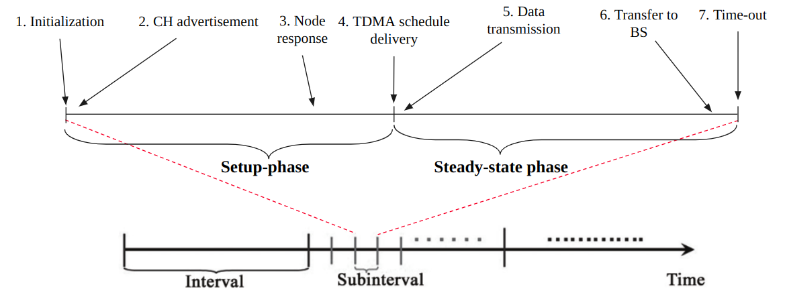
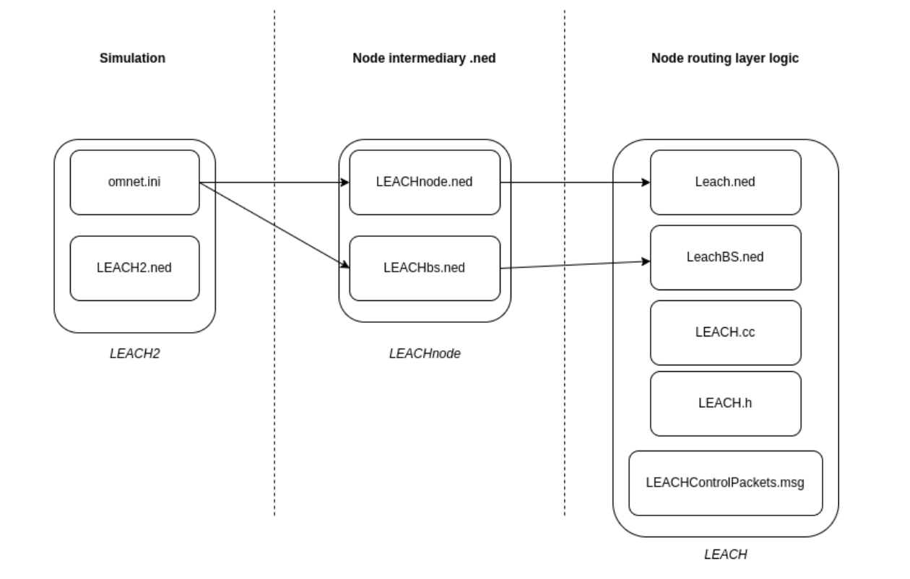

# LEACH

The LEACH (Low-energy adaptive clustering hierarchy) is a hierachical adhoc routing protocol for Wireless Sensor Networks. It is based on the [paper](https://ieeexplore.ieee.org/abstract/document/926982) by W.R. Heinzelman et.al titled _Energy-efficient communication protocol for wireless microsensor networks_ published in 2000.
The code in this repository is an implementation of it for the [INET Framework](https://inet.omnetpp.org) of the [OMNeT++](https://omnetpp.org) simulator.

Unlike the standard LEACH protocol, the implemented version uses IEEE 802.15.4 standard to manage to the Physical and Data-Link layers. However as described in the original paper, the setup phase runs on CSMA with the steady state phase operating on slotted TDMA. Accordingly the stages are as follows;

<figure>
    
</figure>

Follow the below steps to run the simulation.

1. Prerequisites 

2. Install OMNeT++, INET Framework -

3. Run models

## 1. Prerequisites

These models have been tested on the following versions of INET and OMNeT++.

- OMNeT++ version 5.6.2

- INET Framework version 4.2.5

## 2. Install and Build

Follow the following procedure to install and build the models.

1. Install and build [OMNeT++](https://omnetpp.org)

2. Create a new workspace in the OMNeT++ IDE

3. Install and build the [INET Framework](https://inet.omnetpp.org) in the created workspace

4. Copy the `LEACHnode` and `leach` directories present in the `node` and `routing` directories respectively to the `node` and `routing` directories in the your installed INET project.

5. Import the `LEACH3` project into the workspace via `Existing project into Workspace` option. Link it with INET using `properties > project references` and ticking on the `inet` option.

6. Rebuild INET and LEACH3  projects

## 3. Running Models

- Use the *omnetpp.ini* files provided in the LEACH3 directory to run the simulation

- Important parameters are referenced via comments within the *omnetpp.ini* file.

## File structure

<figure>
    
</figure>

The simulations consists of 3 layers organized by their directories;

- Simulation components - `<workspace_home>/LEACH3`

- Node intermediary layer - `<workspace_home>/inet4/src/inet/node/LEACHnode`

- Node routing logic layer - `<workspace_home>/inet4/src/inet/routing/leach`

## Licenses

This model is released under LGPL v3.0 license.

## Questions or Comments

If you have any questions, comments or suggestions, please include them as an issue in this repository.
Please be mindful to adhere to the issue template provided and add a reply when an issue is resolved.

Resolved issues will be closed at the maintainers discretion once identified as stale.

## Model Developers

This model was designed and  developed by,

  - [Nuwan Jayawardene](https://github.com/n-jay)

